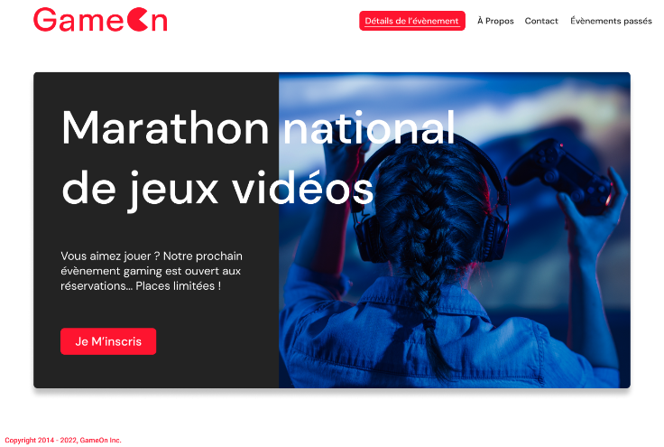

# Projet GameOn
Openclassrooms Projet 4 : Créez une landing page avec Javascript - Site GameOn

Le context du projet : 

 - Recruté en tant que développeur Front-End junior dans une PME, GameOn.
 - Entreprise spécialisée dans les conférences et les concours de jeux.
 - Volonté de simplification de la page d'accueil et du formulaire d’inscription aux concours suite aux retours utilisateurs.
 - Le développeur n’a pas eu le temps de terminer le projet avant son départ pour un nouveau job.
 - Objectif : prendre le relais sur le développement et le terminer.

Cahier des charges : 

 - Spécifications techniques : 
    - Travailler sur un repo forké.
    - Utiliser des fichiers séparés pour le HTML, le CSS et le JavaScript.
    - Utilisation exclusive du JavaScript (pas de jquery).
    - Commenter le code.
    - 2 maquettes à réviser et une Pop-up à créer.
    - S’assurer que l’affichage soit responsive.
 - Spécifications fonctionnelles : 
    - Rendre fonctionnel le bouton X pour fermer le formulaire.
    - Mise en place d’un contrôle des informations saisies par l’utilisateur.
    - Mise en place de messages d’erreur en cas de saisie incorrecte.
    - Mise en place de la validation du formulaire au click du bouton d’envoi.
    - Ajouter un message de confirmation après la validation réussie du formulaire.
